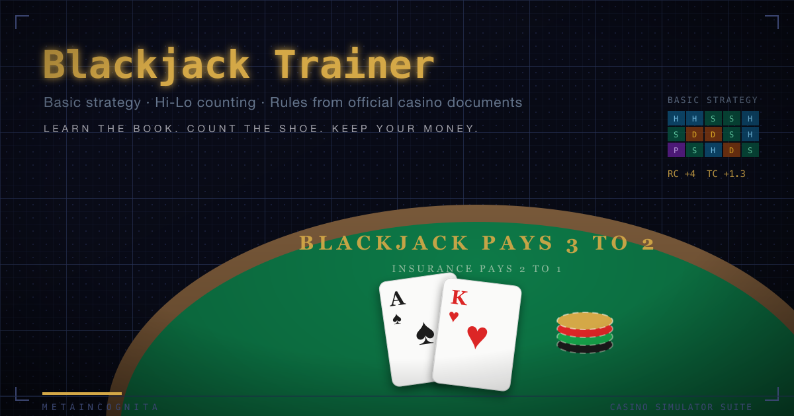

  

# Blackjack Trainer

Authentic casino blackjack simulator and trainer — basic strategy coaching and Hi-Lo card
counting practice on rules taken from official gaming-commission documents, not folklore.

> **This is a single-player simulation only.** No real money is wagered, won, or lost. There is
> no multiplayer, no server, no accounts, and no connection to any casino or gambling service.
> All bankrolls are fictitious. The sole purpose is education.

## Features

- **Five rulebook-cited presets + full custom editor** — MA 205 CMR, Bally's AC, WA card room,
  Vegas Strip, single-deck 6:5; every preset shows its computed house edge (model estimate)
- **Casino procedure or quick play** — paced card-by-card dealing with dealer announcements,
  burn/cut-card/penetration mechanics, or instant resolution; one engine underneath
- **Real-time advisor** — coach / feedback / exam intensities, EV table per decision, mistake
  cost in dollars, count deviations (Illustrious 18 + Fab 4) behind an advanced toggle
- **Round verdicts where your eyes are** — a big WIN/LOSE banner on the felt and an advisor
  recap of every settled round: what happened, why, the bankroll change, and the strategy
  moments ("Book: draw on hard 12 vs 10 — you stood, cost $5.40")
- **Hi-Lo counting** — running/true count from visible cards only, self-check (press C),
  shuffle quizzes, accuracy tracking
- **History & analysis** — every decision graded ✓/✗ vs book with cost and RC/TC; adherence by
  category, top repeated mistakes, EV lost vs actual P&L, side-bet ledger, bot P&L by persona
- **Learn page** — strategy chart generated from the EV engine for the active rules (tap a cell
  for the math), rules lab with live edge deltas, side-bet pay tables, game history, myths,
  procedure guide
- **Four drills** — Strategy Flash (weighted toward your mistakes), Count the Cards,
  True-Count Conversion, Deviation Quiz
- **Bot companions** — five personas with strategy leaks you can measure on the analysis page
- **Bulletproof persistence** — a mid-round refresh restores the exact table, count included
- **Four side bets with official pay tables** — 21+3, Lucky Ladies, Match the Dealer, Buster
- **Engine verified by simulation** — 200k seeded rounds converge on the computed house edge

## Learn the Game

### A Brief History of Blackjack

**Ventiuna (c. 1601).** The earliest known reference to twenty-one is Spanish: Miguel de
Cervantes — a gambler before he was a novelist — has the card cheats of his novella
*Rinconete y Cortadillo* (written around 1601–02, published 1613) working a game called
**ventiuna**, in which the goal is to reach twenty-one without going over and the ace already
counts as one or eleven. The game's mathematical skeleton is over four centuries old.

**Vingt-et-un (1700s).** The French refined the Spanish game into **vingt-et-un**
("twenty-one"), a fixture of Parisian salons in the eighteenth century. Tradition links it to
the court of Louis XV and, later, to Napoleon, who is said to have played it in exile —
well-worn lore, thinly documented, but a measure of how fashionable the game became. French
colonists carried it to New Orleans, and it moved up the Mississippi with the riverboats.

**How "twenty-one" became "blackjack" (c. 1900–1931).** The often-told story is that American
gambling halls offered a promotional 10-to-1 bonus when a player's two-card twenty-one was the
**ace of spades plus a black jack** — and the bonus's name stuck to the whole game. Gaming
historians note the record is messier: the term appears among Klondike-era miners (for whom
"blackjack" was prospector slang) before the bonus story can be verified, so treat the legend
as legend. What is certain: when **Nevada legalized casino gambling in 1931**, the game was
licensed as blackjack, and the name was permanent.

**The Four Horsemen (1956).** Four U.S. Army mathematicians at the Aberdeen Proving Ground —
**Roger Baldwin, Wilbert Cantey, Herbert Maisel, and James McDermott** — spent eighteen months
with desk calculators computing the first accurate basic strategy, published as "The Optimum
Strategy in Blackjack" in the *Journal of the American Statistical Association*. They showed a
disciplined player could cut the house edge to nearly zero — a result so far from casino
folklore that it was widely disbelieved.

**Thorp and the count (1962).** MIT mathematician **Edward O. Thorp** put the Four Horsemen's
work on an IBM 704, proved the deck has a memory — removed cards change the odds — and
published ***Beat the Dealer***, the first system that gave the player a verified edge. The
book hit the New York Times bestseller list; casinos briefly changed the rules of the game in
panic, then changed them back when the tables emptied. **Harvey Dubner's Hi-Lo count (1963)**,
refined by IBM's **Julian Braun** and later codified by writers like Stanford Wong and Don
Schlesinger (whose *Illustrious 18* deviations this trainer teaches), turned Thorp's insight
into the practical system still used today.

**Teams and the law (1970s–1990s).** **Ken Uston's** team play — big players signaled into hot
shoes by counters flat-betting the minimum — beat casinos for millions and produced a landmark
ruling: in *Uston v. Resorts International* (1982), the New Jersey Supreme Court held Atlantic
City casinos could not bar players merely for counting. Casinos answered with more decks,
earlier shuffles, and surveillance. The **MIT blackjack teams** ran the playbook into the
1990s, later mythologized in *Bringing Down the House* (2002) and the film *21* (2008).

**The modern game.** Today's casino counters the counter with six- and eight-deck shoes,
shallow penetration, continuous shuffling machines, and — most expensively for the player —
**6:5 blackjack payouts**, which first spread through Las Vegas single-deck games in the early
2000s and add roughly 1.4% to the house edge. That arms race is exactly what this trainer
simulates: every preset is built from a real rulebook, and the 6:5 single-deck preset exists
to show you why the "good-looking" game is the worst one on the floor.

### Tidbits

- Blackjack is the most-played casino table game in the United States — it overtook faro and
  craps in the mid-twentieth century and never gave the lead back.
- The house edge does not come from the dealer's skill — the dealer has no decisions. It comes
  from the **double-bust asymmetry**: when you bust, you lose immediately, even if the dealer
  busts the same round.
- The dealer busts about **28%** of rounds under standard rules — and basic strategy's "stand
  on a stiff vs a weak upcard" lines exist purely to harvest those busts.
- **Insurance is not insurance.** It is a separate side bet that the hole card is a ten, and
  it pays 2:1 on odds that are worse than 2:1 in every standard shoe. "Even money" is the same
  bet wearing a disguise.
- Perfect basic strategy is worth more than any betting system: it cuts the edge to under 1%
  on good rules. No progression — Martingale included — changes the expected value of a single
  hand.
- The Four Horsemen did their 1956 calculations on **hand-cranked desk calculators**; Thorp
  needed an IBM 704 mainframe to go further. This trainer's EV engine re-derives their charts
  from scratch in your browser and pins them against the published tables in CI.

### Variations

| Variation | The twist | The catch |
|---|---|---|
| **Spanish 21** | All four tens removed; liberal doubling, bonus 21s | Removing tens is worth ~2% to the house before the bonuses claw some back |
| **Pontoon** (UK) | Dealer's cards both hidden; "five-card trick" beats 20 | Ties lose to the dealer |
| **European no-hole-card** | Dealer takes no hole card until players finish | Doubles and splits lose in full to a dealer blackjack |
| **Double Exposure** | Both dealer cards face up | Blackjack pays even money; ties lose |
| **Blackjack Switch** | Two hands; you may swap their second cards | Blackjack pays 1:1; dealer 22 pushes |
| **Free Bet** | "Free" doubles and splits on common totals | Dealer 22 pushes everything |
| **Super Fun 21** | Late surrender any time, player 21 always wins | Blackjack pays even money except in diamonds |

The rule of thumb the trainer teaches: **every flashy rule is paid for somewhere else on the
felt.** The Learn page's rules lab lets you toggle any rule and watch the house edge move.

## Rules Reference

| Source | Type |
|--------|------|
| Massachusetts Gaming Commission, 205 CMR blackjack rules | `docs/Rules-Blackjack-10-08-2020.pdf` |
| Bally's Atlantic City gaming guide | `docs/BLYS_AC-BlackJack-GamingGuide-4x9-Updated.pdf` |
| Washington State Gambling Commission rules | `docs/Blackjack Game Rules Revised April 2018 cc.pdf` |

## Setup

    pnpm install
    pnpm dev        # http://localhost:3000
    pnpm test       # engine + component suites
    pnpm test:e2e   # Playwright

Part of the **Metaincognita** simulator family: Hold'em, Video Poker, Flameout, Craps,
Pachinko, Slots. Suite-wide standards live in
[`docs/METAINCOGNITA-GUIDELINES.md`](docs/METAINCOGNITA-GUIDELINES.md).
